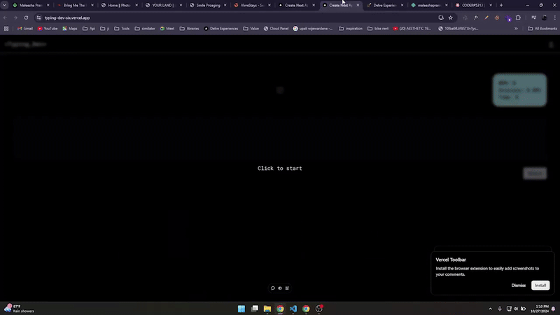

# Typing Test Application

> **⚠️ Project Status: Archived**  
> This project is no longer maintained or receiving updates.

A modern, AI-powered typing test application built with Next.js that generates custom typing phrases based on subjects, difficulty levels, and length preferences using Google's Gemini AI.

## � Preview



## �🚀 Features

- **AI-Generated Phrases**: Leverages Google Gemini AI to generate contextual typing phrases based on:
  - Subject matter (e.g., programming, medicine, law)
  - Difficulty level (easy, normal, hard)
  - Custom phrase length
  
- **Real-Time Metrics**: Track your typing performance with:
  - Words Per Minute (WPM)
  - Accuracy percentage
  - Live character-by-character feedback
  
- **Visual Feedback**: 
  - Green highlighting for correct characters
  - Red highlighting for incorrect characters
  - Real-time error detection

- **Modern UI**: Built with:
  - Tailwind CSS for styling
  - Radix UI components
  - shadcn/ui component library
  - Responsive design

## 🛠️ Tech Stack

- **Framework**: [Next.js 14](https://nextjs.org/) (App Router)
- **Language**: TypeScript
- **Styling**: Tailwind CSS
- **UI Components**: Radix UI, shadcn/ui, Lucide React Icons
- **AI Integration**: Google Generative AI (Gemini 1.5 Flash)
- **Authentication**: NextAuth.js v5 (beta)

## 📋 Prerequisites

- Node.js 20.x or higher
- npm, yarn, pnpm, or bun
- Google Gemini API Key

## ⚙️ Installation

1. Clone the repository:
```bash
git clone <repository-url>
cd typing-dev
```

2. Install dependencies:
```bash
npm install
```

3. Set up environment variables:
Create a `.env.local` file in the root directory and add your Gemini API key:
```env
NEXT_PUBLIC_GEMINI_API_KEY=your_gemini_api_key_here
```

## 🚀 Getting Started

Run the development server:

```bash
npm run dev
# or
yarn dev
# or
pnpm dev
# or
bun dev
```

Open [http://localhost:3000](http://localhost:3000) with your browser to see the application.

## 📁 Project Structure

```
typing-dev/
├── src/
│   ├── app/                    # Next.js app directory
│   │   ├── page.tsx           # Home page
│   │   ├── layout.tsx         # Root layout
│   │   ├── globals.css        # Global styles
│   │   └── login/             # Login page
│   ├── components/
│   │   ├── elements/          # Reusable UI elements
│   │   │   ├── Navigationbar.tsx
│   │   │   ├── icons/         # Custom icon components
│   │   │   ├── models/        # Modal components
│   │   │   └── screens/       # Screen components
│   │   ├── layouts/           # Layout components
│   │   │   └── TypingTest.tsx # Main typing test component
│   │   └── ui/                # shadcn/ui components
│   ├── hooks/                 # Custom React hooks
│   ├── lib/                   # Utility libraries
│   │   ├── utils.ts
│   │   └── services/
│   └── utils/
│       └── phraseGenerator.js # AI phrase generation logic
├── public/                    # Static assets
├── components.json            # shadcn/ui configuration
├── tailwind.config.ts         # Tailwind configuration
└── tsconfig.json             # TypeScript configuration
```

## 🎮 How to Use

1. **Start the Application**: Launch the typing test from the start screen
2. **Begin Typing**: Start typing the displayed phrase in the text area
3. **Track Progress**: Watch real-time feedback as you type:
   - Correct characters turn green
   - Incorrect characters turn red with a red background
4. **Finish**: Press Enter to complete the test and view your WPM
5. **Restart**: Press Enter again to get a new phrase and restart

## 🎯 Key Components

- **TypingTest.tsx**: Core typing test logic with state management and real-time character validation
- **phraseGenerator.js**: AI-powered phrase generation using Google Gemini
- **StartScreen.tsx**: Initial screen before starting the test
- **PhrasesSettingsModal.tsx**: Settings dialog for customizing phrase generation (UI implementation)

## 🏗️ Build & Deploy

Build the application for production:

```bash
npm run build
```

Start the production server:

```bash
npm start
```

The application can be deployed to [Vercel](https://vercel.com), [Netlify](https://netlify.com), or any platform that supports Next.js.

## 📝 Scripts

- `npm run dev` - Start development server
- `npm run build` - Build for production
- `npm start` - Start production server
- `npm run lint` - Run ESLint

## 🔑 Environment Variables

| Variable | Description | Required |
|----------|-------------|----------|
| `NEXT_PUBLIC_GEMINI_API_KEY` | Google Gemini API key for phrase generation | Yes |

## ⚖️ License

This project is private and not licensed for public use.

## 🙏 Acknowledgments

- Built with [Next.js](https://nextjs.org/)
- UI components from [shadcn/ui](https://ui.shadcn.com/)
- AI powered by [Google Gemini](https://ai.google.dev/)
- Icons from [Lucide](https://lucide.dev/) and [Radix Icons](https://www.radix-ui.com/icons)
